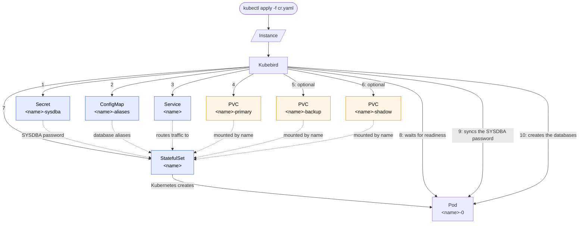

# Kubebird

## Overview
[Kubebird](https://github.com/henryx/kubebird) is a Kubernetes operator based on kubebuilder to install and manage [Firebird RDBMS](https://firebirdsql.org/) instances

## Installation

### Prerequisites

- A Kubernetes cluster you have `cluster-admin` on (needed to install the CRD and RBAC).
- `kubectl`, configured against that cluster.
- To build from source: Go (see `go.mod` for the required version), `make`, and a container tool
  (Docker or podman) if you also want to build/push your own manager image.

### From the latest release

Tagging the repository with a semver tag (e.g. `0.2.0`) triggers the `Release` GitHub Actions
workflow, which builds and pushes the manager image to `quay.io/kubebird/operator` (tagged with
both the release version and `latest`) and publishes a GitHub Release with a consolidated
`install.yaml` (CRD + RBAC + Deployment) attached.

Install the latest release directly:

```bash
kubectl apply -f https://github.com/henryx/kubebird/releases/latest/download/install.yaml
```

This deploys the operator into the `kubebird-system` namespace. The manager requires a
`WATCH_NAMESPACE` env var (set on the Deployment) naming the namespace, or comma-separated list of
namespaces, whose `Instance` resources it should reconcile. Edit the Deployment's env after
applying, or edit `config/manager/manager.yaml` before building your own manifest, to change it.

Uninstall by deleting the same manifest (this also removes the CRD, and with it every `Instance`
resource cluster-wide):

```bash
kubectl delete -f https://github.com/henryx/kubebird/releases/latest/download/install.yaml
```

Both the release and the `dev` build below only publish once lint, unit/envtest, and e2e tests all
pass on the triggering commit.

### Development builds

Every push to `main` also publishes `quay.io/kubebird/operator:dev`, a rolling image for trying
out unreleased changes. It's not attached to a versioned tag or a GitHub Release, so build your
own manifest against it:

```bash
make build-installer IMG=quay.io/kubebird/operator:dev
kubectl apply -f dist/install.yaml
```

### From source

Clone the repository, then either build a consolidated manifest yourself:

```bash
make build-installer IMG=<your-registry>/operator:<tag>
kubectl apply -f dist/install.yaml
```

or deploy directly against the cluster in your current `~/.kube/config` context:

```bash
make deploy IMG=<your-registry>/operator:<tag>
```

`IMG` defaults to `quay.io/kubebird/operator:latest` if omitted, so if you haven't built and pushed
your own image, set it to a registry you control (`make docker-build docker-push IMG=...`) first.
`make deploy` runs `make manifests` first, so it always installs the CRD matching your checked-out
code.

To install just the CRD, without the operator itself (useful when running the manager locally via
`make run`):

```bash
make install
```

Tear down what you deployed with the matching target: `make undeploy` for `make deploy`, or
`make uninstall` for `make install` (both accept `ignore-not-found=true`).

## Architecture
Project uses the namespaced CR `Instances` that defines Firebird instance.

This is a sample of `Instances`:
```yaml
apiVersion: kubebird.github.io/v1
kind: Instance
metadata:
  name: test
spec:
  image: firebirdsql/firebird
  version: 3.0.14
  databases:
    - name: "instance.fdb"
      shadow: false
      pageSize: 8192 # defaults to 8192; one of 4096, 8192, 16384
      charset: UTF8 # defaults to UTF8
      collation: UTF8 # defaults to UTF8
    - name: "shadowed.fdb"
      alias: "enforced" # if not specified, uses database name as alias
      shadow: true
  service:
    type: ClusterIP
    port: 3050 # port the Service exposes the instance on; defaults to 3050
  storage:
    primary:
      class: "" # if empty, uses the default storage class
      size: 3Gi
    backup: # Optional, but useful
      class: ""
      size: 3Gi
    shadow: # can be omitted if no database below has "shadow: true"
      class: ""
      size: 3Gi
  authentication:
    sysdba:
      secretRef: ""
```

With this CR, Kubebird can:
- Deploy an instance of Firebird, in a StatefulSet mode using `image` and `version` specified, in whichever namespace the `Instance` itself is created in. The `firebird` container sets `allowPrivilegeEscalation: false` and a `RuntimeDefault` seccomp profile, satisfying the `baseline` Pod Security Standard; it does **not** run as non-root or drop capabilities, since the `firebirdsql/firebird` image's entrypoint needs root's full DAC override (e.g. to manage files owned by its own `firebird` user) whenever `FIREBIRD_ROOT_PASSWORD` is set, which Kubebird always does — so `Instance` pods can't satisfy the stricter `restricted` standard, and the namespace they run in must enforce `baseline` or looser.
- Create a service for the instance. Default service type is `ClusterIP`, exposed on `service.port` (defaults to `3050`); the pod's container port is always `3050` regardless of this setting.
- Define the PVC used for the instance's primary data (`storage.primary`), named `<instance-name>-primary`, with specified size and storage class. If storage class isn't specified, it uses the default storage class. Size must be a valid Kubernetes quantity (e.g. `3Gi`, `500Mi`); the CRD rejects anything else. Since this PVC isn't owned by the `Instance` (see "Deleting an Instance" below), a new `Instance` reusing a previous one's name reuses its primary PVC too; if a database's file is already there, Kubebird registers it into `status.databases` instead of trying (and failing) to `CREATE DATABASE` again.
- Optionally define a `<instance-name>-backup` PVC (`storage.backup`), mounted into the pod at `/var/lib/firebird/backup`. Omit it if you don't need a dedicated backup volume. Like the primary/shadow PVCs, it isn't owned by the `Instance` — deleting the `Instance` leaves it (and its backup data) in place instead of garbage-collecting it. Setting it also changes what happens to the *other* storage on deletion — see "Deleting an Instance" below. It also feeds back into provisioning: for a database that isn't already on the primary PVC, if a backup for it exists at `<mount>/<instance-name>/<database>.fbk` (e.g. because this `Instance`'s name was deleted-with-backup and is now being recreated), Kubebird restores it via `gbak -create -verify` instead of creating an empty database, recreating its shadow file too if `shadow: true`.
- Declare a list of the databases managed by instance. Based by of the configuration, database can be instantiated in shadow mode; shadow files live on a second, separate PVC (`storage.shadow`, named `<instance-name>-shadow`), which is required if any database has `shadow: true`. Each database can also set `pageSize` (one of `4096`, `8192`, `16384`; defaults to `8192`), `charset` and `collation` (both default to `UTF8`).
- Register a Firebird alias for each database in `/opt/firebird/databases.conf` using a ConfigMap called `<instance-name>-aliases`, so clients can connect using that alias instead of the in-pod filesystem path. Uses `alias` if set, otherwise falls back to the database's own `name` (e.g. `instance.fdb`). Since this file replaces the image's own `databases.conf` rather than merging with it, Kubebird also adds a `security.db` alias for the instance's security database (`RemoteAccess = false`, so it's only reachable through the embedded/local connection Kubebird itself uses), which the image's default file would otherwise have provided.
- Authentication is optional. If `authentication.sysdba.secretRef` is specified, Kubebird uses that Secret for the SYSDBA password; if it isn't specified, Kubebird creates a `<instance-name>-sysdba` secret with a random password. Either way, the secret has `username` (always `SYSDBA`) and `password` keys.
- Label every object it creates (PVCs, Service, StatefulSet, the aliases ConfigMap, and the SYSDBA secret) with `kubebird.github.io/instance: <name>`, so `kubectl get all,pvc,secrets,configmaps -l kubebird.github.io/instance=<name>` finds everything for one `Instance`.
- Report the most recent error, if any, in `status.error` — surfaced without needing to check the operator's own logs, via the `MESSAGE` column below. It's cleared automatically once the `Instance` reconciles successfully again.
- Surface `kubectl get instances` columns beyond the default `NAME`/`AGE`: `VERSION` (the Firebird version deployed, from `spec.version`), `STATUS` (`Provisioning`, `Ready`, or `Deleting`), `DATABASES` (the number of databases currently provisioned, i.e. `len(status.databases)`), and `MESSAGE` (the reconcile error if the last reconcile failed; otherwise, while `Provisioning`/`Ready`, why it's currently in that phase; while `Deleting`, the specific operation deletion is currently performing, e.g. "Backing up databases into storage.backup" — see "Deleting an Instance" below).

### Object creation flow

When an `Instance` is created, Kubebird creates the objects below in order (steps 1-7); every one
except the primary/backup/shadow PVCs is owned by the `Instance` and removed automatically when the
`Instance` is deleted (see "Deleting an Instance" below). Kubernetes then creates the Pod from the
`StatefulSet`'s template, and once the Pod becomes ready Kubebird syncs the SYSDBA password and
creates the requested databases inside it (steps 8-10):



The dotted arrows show how the `StatefulSet` uses the other objects (the SYSDBA password from the
secret, database aliases from the ConfigMap, traffic routing from the Service, primary/backup/shadow
data from the PVCs, referenced by name) rather than a separate creation step; the Pod, by contrast,
is created directly by Kubernetes from the `StatefulSet`'s template. The backup `PVC` only exists
when `storage.backup` is set on the `Instance`, and the shadow `PVC` only exists when
`storage.shadow` is set.

Kubebird also reacts to updates on an existing `Instance`:
- Changing `spec.service.type`, `spec.service.port`, or `spec.version` reconciles the
  `Service`/`StatefulSet` in place.
- Adding an entry to `spec.databases` provisions just that new database (existing ones are left
  alone) and registers its alias immediately, without needing a pod restart.
- Removing an entry from `spec.databases` runs `DROP DATABASE` for just that database (Firebird
  removes its shadow file, if any, along with it), drops it from `status.databases`, and removes
  its alias from `databases.conf` — again without a pod restart.
- Rotating the SYSDBA secret's password (the auto-generated one, or a user-provided
  `authentication.sysdba.secretRef`) pushes the new password to the live server automatically, so
  the secret and the running instance never drift apart.

Deleting an `Instance` relies on Kubernetes garbage collection of the objects Kubebird created for
it (the Secret, aliases ConfigMap, Service and StatefulSet are all owned by the `Instance`); the
operator itself just logs the deletion, reports `status.phase: Deleting`, and updates
`status.message` with the specific operation it's currently performing (e.g. "Deleting Instance",
or one of the backup-related steps below), while that garbage collection runs. The
primary/backup/shadow PVCs are **not** removed with it — Kubebird deliberately
never sets an owner reference on them, so an `Instance`'s data survives its deletion. Delete the PVCs
yourself once you're sure you no longer need the data:
```bash
kubectl delete pvc -l kubebird.github.io/instance=<name>
```

If `storage.backup` is configured, deletion does one more thing first: before removing its
finalizer, Kubebird backs up every database in `status.databases` into a subdirectory of
`storage.backup` dedicated to this `Instance` (`<mount>/<instance-name>/<database>.fbk`, via
`gbak -backup -verify`) — keeping backups from different `Instance`s, or from successive
generations of one reusing the same backup PVC (since it survives deletion), from colliding — then
deletes the primary and shadow PVCs itself; the backup PVC is the only one left behind. This
requires the StatefulSet's pod to be ready, so deletion waits for it if needed (reporting "Waiting
for the Firebird pod to be ready before backing up databases" in `status.message` while it does);
if no database was ever provisioned, the primary/shadow PVCs are released immediately without
waiting for a running pod. `status.message` tracks each step as it happens — "Backing up databases
into storage.backup", then "Releasing primary and shadow storage", then "Removing finalizer" — so
`kubectl get instances` shows real deletion progress rather than a stale pre-deletion message.

Recreating an `Instance` with the same name closes the loop: since the backup PVC was left behind,
its databases are restored from those `.fbk` files instead of being created empty — see the
`storage.backup` bullet above.

## License

Kubebird is licensed under the [Apache License 2.0](LICENSE).