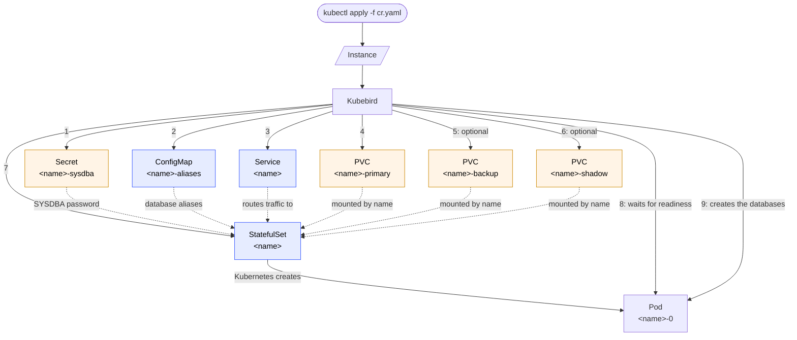

# Kubebird

## Overview
[Kubebird](https://github.com/henryx/kubebird) is a Kubernetes operator based on kubebuilder to install and manage [Firebird RDBMS](https://firebirdsql.org/) instances

## Features

- Deploys a Firebird instance as a single-replica StatefulSet from a namespaced `Instance` custom
  resource, exposed via a `ClusterIP` (or other) `Service`.
- Manages dedicated primary, backup, and shadow PVCs. The primary and shadow PVCs are always
  deleted along with the `Instance`; the backup volume — created when `spec.backup.enabled` is set
  *and* `spec.backup.destinations` has a `local` entry — always survives deletion instead, so its data can
  be restored later.
- Provisions and drops databases declared in `spec.databases` (including page size, charset,
  collation, and shadow files) as the list changes, without requiring a pod restart.
- Registers a Firebird alias per database automatically, so clients can connect by alias instead of
  in-pod filesystem path.
- Generates a SYSDBA credentials Secret (or uses one you supply) and restarts the pod to apply the
  password whenever the Secret changes. The Secret is never removed when the `Instance` is deleted,
  so it (and its password) survive and are reused if an `Instance` with the same name is recreated.
- When a local backup volume is configured (`spec.backup.enabled` with a `local` entry in
  `spec.backup.destinations`) and `spec.backup.backupOnDelete` is `true` (the default), backs up
  every database with `gbak`, plus the security database itself (users/roles included) the same way,
  before releasing the primary/shadow storage on deletion — briefly stopping the pod first, since
  `gbak` can't back up a database while the live server has it open — then restores from those
  backups automatically if an `Instance` with the same name is recreated — including across a
  Firebird major-version bump (e.g. `3.0.14` to `4.0.3`), since `gbak` restores are forward-compatible
  with backups taken by an older version. Setting `spec.backup.backupOnDelete` to `false` skips that
  final backup while still releasing the primary/shadow storage. Without a backup volume, a
  recreated `Instance` starts fresh instead.
- Warns via `status.warning`/`status.message` about orphaned backups left behind when a recreated
  `Instance` no longer declares a database that has a backup on disk.
- Independently of `backupOnDelete`, `spec.backup.retention` runs recurring scheduled backups (hourly,
  daily, weekly, monthly, and/or yearly) into the same local backup volume, keeping the last `n`
  backups configured per frequency. Each enabled frequency gets its own native Kubernetes `CronJob`,
  which triggers a full, `nbackup`-style backup of every database in `spec.databases` — via the
  Services API, since `nbackup` itself only backs up a database local to wherever it runs — against the
  instance's own live server, so, unlike the `gbak`-based `backupOnDelete` backup, it never needs to
  stop the pod; the result is then gzip-compressed. The security database is deliberately excluded from
  these scheduled backups, since Firebird refuses to back it up remotely while the server has it open;
  it stays covered by the `backupOnDelete` backup instead.
- Surfaces `VERSION`, `STATUS`, `DATABASES`, and `MESSAGE` printer columns on `kubectl get instances`
  for at-a-glance visibility into each instance's state.

## Installation

### Prerequisites

- A Kubernetes cluster you have `cluster-admin` on (needed to install the CRD and RBAC).
- `kubectl`, configured against that cluster.
- To build from source: Go (see `go.mod` for the required version), `make`, and a container tool
  (Docker or podman) if you also want to build/push your own manager image.

### From the latest release

Tagging the repository with a semver tag (e.g. `0.2.0`) triggers the `Release` GitHub Actions
workflow, which builds and pushes the manager image to `quay.io/kubebird/operator` (tagged with
both the release version and `latest`) and publishes a GitHub Release with a consolidated
`install.yaml` (CRD + RBAC + Deployment) attached.

Install the latest release directly:

```bash
kubectl apply -f https://github.com/henryx/kubebird/releases/latest/download/install.yaml
```

This deploys the operator into the `kubebird-system` namespace. The manager requires a
`WATCH_NAMESPACE` env var (set on the Deployment) naming the namespace, or comma-separated list of
namespaces, whose `Instance` resources it should reconcile. Edit the Deployment's env after
applying, or edit `config/manager/manager.yaml` before building your own manifest, to change it.

Uninstall by deleting the same manifest (this also removes the CRD, and with it every `Instance`
resource cluster-wide):

```bash
kubectl delete -f https://github.com/henryx/kubebird/releases/latest/download/install.yaml
```

Both the release and the `dev` build below only publish once lint, unit/envtest, and e2e tests all
pass on the triggering commit.

### Development builds

Every push to `main` also publishes `quay.io/kubebird/operator:dev`, a rolling image for trying
out unreleased changes. It's not attached to a versioned tag or a GitHub Release, so build your
own manifest against it:

```bash
make build-installer IMG=quay.io/kubebird/operator:dev
kubectl apply -f dist/install.yaml
```

### From source

Clone the repository, then either build a consolidated manifest yourself:

```bash
make build-installer IMG=<your-registry>/operator:<tag>
kubectl apply -f dist/install.yaml
```

or deploy directly against the cluster in your current `~/.kube/config` context:

```bash
make deploy IMG=<your-registry>/operator:<tag>
```

`IMG` defaults to `quay.io/kubebird/operator:latest` if omitted, so if you haven't built and pushed
your own image, set it to a registry you control (`make docker-build docker-push IMG=...`) first.
`make deploy` runs `make manifests` first, so it always installs the CRD matching your checked-out
code.

To install just the CRD, without the operator itself (useful when running the manager locally via
`make run`):

```bash
make install
```

Tear down what you deployed with the matching target: `make undeploy` for `make deploy`, or
`make uninstall` for `make install` (both accept `ignore-not-found=true`).

## Architecture
Project uses the namespaced CR `Instances` that defines Firebird instance.

This is a sample of `Instances`:
```yaml
apiVersion: kubebird.github.io/v1
kind: Instance
metadata:
  name: test
spec:
  image: firebirdsql/firebird
  version: 3.0.14
  databases:
    - name: "instance.fdb"
      shadow: false
      pageSize: 8192 # defaults to 8192; one of 4096, 8192, 16384
      charset: UTF8 # defaults to UTF8
      collation: UTF8 # defaults to UTF8
    - name: "shadowed.fdb"
      alias: "enforced" # if not specified, uses database name as alias
      shadow: true
  service:
    type: ClusterIP
    port: 3050 # port the Service exposes the instance on; defaults to 3050
  storage:
    primary:
      class: "" # if empty, uses the default storage class
      size: 3Gi
    shadow: # can be omitted if no database below has "shadow: true"
      class: ""
      size: 3Gi
  authentication:
    sysdba:
      secretRef: "" # if empty, password is generated randomically
  backup: # backup section
    enabled: true # enable or disable backup
    image: firebirdsql/firebird:3.0.14 # uses a specific image (default is the same image used for instance)
    backupOnDelete: true # if enabled, execute a last backup using gbak in configured destinations when CR is deleted. default is true 
    destinations:
      - local: # use a dedicated PVC
          storage:
            class: ""
            size: 3Gi
    retention: # set retention for every defined frequency. if a frequency has retention 0, it's disabled. these backups are made with nbackup and retention defaults is 0
      hour: 0  # start every hour, maintain last n backups
      day: 0   # start at 00:00 of every day
      week: 0  # start every Sunday
      month: 0 # start first day of month
      year: 0  # start first of January
```

With this CR, Kubebird can:
- Deploy an instance of Firebird, in a StatefulSet mode using `image` and `version` specified, in whichever namespace the `Instance` itself is created in. The `firebird` container sets `allowPrivilegeEscalation: false` and a `RuntimeDefault` seccomp profile, satisfying the `baseline` Pod Security Standard; it does **not** run as non-root or drop capabilities, since the `firebirdsql/firebird` image's entrypoint needs root's full DAC override (e.g. to manage files owned by its own `firebird` user) whenever `FIREBIRD_ROOT_PASSWORD` is set, which Kubebird always does — so `Instance` pods can't satisfy the stricter `restricted` standard, and the namespace they run in must enforce `baseline` or looser.
- Create a service for the instance. Default service type is `ClusterIP`, exposed on `service.port` (defaults to `3050`); the pod's container port is always `3050` regardless of this setting.
- Define the PVC used for the instance's primary data (`storage.primary`), named `<instance-name>-primary`, with specified size and storage class. If storage class isn't specified, it uses the default storage class. Size must be a valid Kubernetes quantity (e.g. `3Gi`, `500Mi`); the CRD rejects anything else. This PVC isn't owned by the `Instance` (so it isn't garbage-collected alongside it), but Kubebird always deletes it itself when the `Instance` is deleted — see "Deleting an Instance" below.
- Optionally define a `<instance-name>-backup` PVC, mounted into the pod at `/var/lib/firebird/backup`, sized via `backup.destinations[].local.storage` — created only when `backup.enabled` is `true` *and* `backup.destinations` has a `local` entry (the only backup destination currently implemented). `backup.backupOnDelete` (defaults to `true`) controls whether deleting the `Instance` runs one last backup into it first; setting it to `false` skips that final backup, but never affects whether the PVC itself is created or retained. See "Backup and restore" below for what Kubebird does with it.
- Declare a list of the databases managed by instance. Based by of the configuration, database can be instantiated in shadow mode; shadow files live on a second, separate PVC (`storage.shadow`, named `<instance-name>-shadow`), which is required if any database has `shadow: true`. Each database can also set `pageSize` (one of `4096`, `8192`, `16384`; defaults to `8192`), `charset` and `collation` (both default to `UTF8`).
- Register a Firebird alias for each database in `/opt/firebird/databases.conf` using a ConfigMap called `<instance-name>-aliases`, so clients can connect using that alias instead of the in-pod filesystem path. Uses `alias` if set, otherwise falls back to the database's own `name` (e.g. `instance.fdb`). Since this file replaces the image's own `databases.conf` rather than merging with it, Kubebird also adds a `security.db` alias for the instance's security database (`RemoteAccess = false`, so it's only reachable through the embedded/local connection Kubebird itself uses), which the image's default file would otherwise have provided.
- Keep the security database (`securityN.fdb`, `N` being the Firebird major version) on the primary PVC (`/var/lib/firebird/data`) instead of the image's own ephemeral install directory, so it survives a pod restart. A `security-database-init` init container seeds it there — on every fresh primary PVC, since Kubebird always deletes the previous one on `Instance` deletion — before the `firebird` container starts, either restoring it from a backup or seeding the image's own default (see "Backup and restore" below); the `security.db` alias above and a `FIREBIRD_CONF_SecurityDatabase` environment variable both point the engine at this same relocated path.
- Authentication is optional. If `authentication.sysdba.secretRef` is specified, that Secret must already exist — Kubebird uses it for the SYSDBA password as-is and fails reconciliation if it's missing, rather than creating it; if it isn't specified, Kubebird creates a `<instance-name>-sysdba` secret with a random password if one doesn't already exist. Either way, the secret has `username` (always `SYSDBA`) and `password` keys, and Kubebird never deletes it, whether on its own or when the `Instance` is deleted — see "Deleting an Instance" below.
- Label every object it creates (PVCs, Service, StatefulSet, the aliases ConfigMap, and the SYSDBA secret) with `kubebird.github.io/instance: <name>`, so `kubectl get all,pvc,secrets,configmaps -l kubebird.github.io/instance=<name>` finds everything for one `Instance`. The `Service` only ever routes traffic to the `StatefulSet`'s own pod, never to a short-lived backup helper Pod/Job (scheduled or deletion-time) that happens to share that label, since its selector also requires a second `app.kubernetes.io/component: firebird` label that only the real pod carries.
- Report the most recent error, if any, in `status.error` — surfaced without needing to check the operator's own logs, via the `MESSAGE` column below. It's cleared automatically once the `Instance` reconciles successfully again.
- Warn, in `status.warning`, when a database that's provisioned or restored (i.e. `spec.databases` has a pending entry) leaves behind an orphaned backup: a `.fbk` file in the backup volume's `base/` subdirectory whose database is no longer in `spec.databases` — typically because the `Instance` was recreated with a different database list, or a database was dropped after its backup was taken. The security database's own backup (`securityN.fbk`) is never reported this way, even though it sits in that same directory. Cleared automatically once no orphaned backup remains.
- Surface `kubectl get instances` columns beyond the default `NAME`/`AGE`: `VERSION` (the Firebird version deployed, from `spec.version`), `STATUS` (`Provisioning`, `Ready`, or `Deleting`), `DATABASES` (the number of databases currently provisioned, i.e. `len(status.databases)`), and `MESSAGE` (the reconcile error if the last reconcile failed; otherwise `status.warning` if one is set; otherwise, while `Provisioning`/`Ready`, why it's currently in that phase; while `Deleting`, the specific operation deletion is currently performing, e.g. "Backing up databases into the backup volume" — see "Deleting an Instance" below).

### Object creation flow

When an `Instance` is created, Kubebird creates the objects below in order (steps 1-7); every one
except the primary/backup/shadow PVCs and the SYSDBA Secret is owned by the `Instance` and removed
automatically when the `Instance` is deleted (see "Deleting an Instance" below). Kubernetes then creates the Pod from the
`StatefulSet`'s template, and once the Pod becomes ready Kubebird creates the requested databases
inside it (steps 8-9):



The dotted arrows show how the `StatefulSet` uses the other objects (the SYSDBA password from the
secret, database aliases from the ConfigMap, traffic routing from the Service, primary/backup/shadow
data from the PVCs, referenced by name) rather than a separate creation step; the Pod, by contrast,
is created directly by Kubernetes from the `StatefulSet`'s template. The backup `PVC` only exists
when `backup.enabled` is set on the `Instance` *and* `backup.destinations` includes a `local` entry
(the only backup destination currently implemented) — `backup.enabled` alone just turns on the
ability to back up, it doesn't by itself create anything (see "Backup and restore" below). The
shadow `PVC` only exists when
`storage.shadow` is set. Before the `firebird` container in that Pod starts, a `security-database-init`
init container (mounting the primary PVC, plus the backup PVC too when it exists)
seeds the security database onto it if it isn't already there — see above.

Kubebird also reacts to updates on an existing `Instance`:
- Changing `spec.service.type`, `spec.service.port`, or `spec.version` reconciles the
  `Service`/`StatefulSet` in place.
- Adding an entry to `spec.databases` provisions just that new database (existing ones are left
  alone) and registers its alias immediately, without needing a pod restart.
- Removing an entry from `spec.databases` runs `DROP DATABASE` for just that database (Firebird
  removes its shadow file, if any, along with it), drops it from `status.databases`, and removes
  its alias from `databases.conf` — again without a pod restart.
- Rotating the SYSDBA secret's password (the auto-generated one, or a user-provided
  `authentication.sysdba.secretRef`) restarts the pod: the `StatefulSet`'s pod template carries an
  annotation hashing the secret's current password, so a rotation changes the template and the
  `StatefulSet` controller's own rolling update recreates the pod, letting the image's entrypoint
  apply the new password the same way it already does for a brand-new `Instance`. This causes a
  short disruption to every connection to the `Instance` while the pod restarts.

### Deleting an Instance

Deleting an `Instance` relies on Kubernetes garbage collection of the objects Kubebird created for
it (the aliases ConfigMap, Service and StatefulSet are all owned by the `Instance`); the
operator itself just logs the deletion, reports `status.phase: Deleting`, and updates
`status.message` with the specific operation it's currently performing (e.g. "Deleting Instance",
or one of the backup-related steps described in "Backup and restore" below), while that garbage
collection runs. The SYSDBA Secret is **not** removed with it — Kubebird deliberately never sets an
owner reference on it, so an `Instance`'s SYSDBA credentials survive its deletion. The primary and
shadow PVCs aren't owner-referenced either, but Kubebird explicitly deletes both of them itself as
part of every deletion, regardless of `spec.backup` — **without a local backup volume configured,
deleting an `Instance` permanently destroys its data.** The backup PVC, when it exists, is always
left behind rather than being deleted along with the primary/shadow storage — see "Backup and
restore" below. Delete it and the Secret yourself once you're sure you no longer need them:
```bash
kubectl delete pvc,secret -l kubebird.github.io/instance=<name>
```

### Backup and restore

A local backup volume exists only when `backup.enabled` is `true` *and* `backup.destinations` has a `local`
entry (the only backup destination currently implemented) — `backup.enabled` alone just turns on
the ability to back up, it doesn't create anything by itself. When configured, Kubebird provisions
the `<instance-name>-backup` PVC described above and, like the primary/shadow PVCs, never
owner-references it — but unlike them, it's also never deleted by Kubebird itself, so once created
it survives every deletion of the `Instance` for its contents to be restored from later.
`backup.image` optionally overrides the image (including tag) used to run the short-lived helper Pod
that performs the deletion-time backup below; if unset, it defaults to the same `image:version` the
`Instance` itself runs.

**On deletion**, whenever a local backup volume exists *and* `backup.backupOnDelete` is `true` (the
default), Kubebird backs up every database before releasing the primary/shadow storage (see
"Deleting an Instance" above): it first stops the pod (scaling the StatefulSet to 0 replicas), since
`gbak` can't back up a database — the security database included — while a live server still has it
open, then runs the short-lived helper Pod, mounting the same PVCs, which runs `gbak -backup -verify`
for every database in `status.databases` into a fixed `base` subdirectory of the backup volume
(`<mount>/base/<database>.fbk` — not named after the `Instance`, since the backup volume is already
a PVC dedicated to it), then the security database itself the same way, into that same directory as
`securityN.fbk`. Backing up the security database happens unconditionally, even when
`status.databases` is empty, since it always exists regardless of `spec.databases` — the only case
that skips the backup step entirely (besides `backup.backupOnDelete` being `false`) is the
StatefulSet no longer existing at all (e.g. already garbage-collected some other way), in which case
Kubebird just releases the storage directly. `status.message` tracks each step as it happens —
"Stopping the Firebird pod to back up its databases", then "Backing up databases into the backup
volume", then, always, "Releasing primary and shadow storage", then "Removing finalizer" — so
`kubectl get instances` shows real deletion progress rather than a stale pre-deletion message.
Setting `backup.backupOnDelete` to `false` skips only that final backup — the primary/shadow PVCs are
still released immediately regardless, so an already-existing backup PVC keeps whatever was in it
from an earlier backup, but nothing taken at delete time. Without a local backup volume, none of this
runs at all: the primary and shadow PVCs are released immediately, and the `Instance`'s data (security
database included) is gone for good.

**On (re)creation**, an `Instance` with the same name only restores its data if a local backup
volume was configured before deletion: since the backup PVC was left behind, a database not already
on the (fresh) primary PVC is restored via `gbak -create -verify` from a matching
`base/<database>.fbk` instead of being created empty, recreating its shadow file too for a
`shadow: true` database, and the security database is restored the same way by the
`security-database-init` init container (which runs before the `firebird` container starts, since no
server is listening yet to `exec` a restore into), carrying over whatever users/roles were created
directly in it. SYSDBA's own password, meanwhile, always comes from the Secret rather than the
restored security database — and since the Secret itself also survives the deletion (see "Deleting
an Instance" above), it's the same password as before the delete/recreate, unless you rotate it
yourself; see "Rotating the SYSDBA secret's password" above. If the recreated `Instance` declares a
different `spec.databases` list than the one that was backed up, any `.fbk` file with no matching
entry is left unrestored and reported in `status.warning` (and thus in the `MESSAGE` column) instead
of being silently ignored. This also works if the recreated `Instance` sets a different
`spec.version`: the new version's own `gbak` restores a `.fbk` backed up by the old version's
`gbak`, so deleting and recreating an `Instance` with a bumped `spec.version` (and the same local
backup volume configured) doubles as a supported way to upgrade between Firebird major versions.
Without a backup volume, there is nothing to restore from: a recreated `Instance` gets fresh, empty
primary/shadow storage and a brand-new security database, just like a first-time `Instance` of that
name.

### Scheduled backups (`backup.retention`)

`backup.retention` runs recurring backups independently of `backupOnDelete` and the deletion flow
above, for as long as the `Instance` lives, into the same local backup volume — it requires one just
the same (`backup.enabled` *and* a `local` entry in `backup.destinations`) and has no effect without
one. Each of its five fields (`hour`, `day`, `week`, `month`, `year`) is both the switch for that
frequency (`0`, the default, disables it) and how many of its backups to keep.

Kubebird creates one native Kubernetes `CronJob` per enabled frequency (`<name>-backup-<frequency>`,
e.g. `<name>-backup-hour`), on the fixed schedule its field name implies — hourly on the hour, daily at
00:00 UTC, weekly at 00:00 UTC on Sunday, monthly at 00:00 UTC on the 1st, yearly at 00:00 UTC on
January 1st — and removes it again if that frequency's count is later set back to `0`. Kubernetes' own
CronJob controller takes it from there: Kubebird itself doesn't track or poll individual runs, so
`kubectl get cronjobs,jobs -l kubebird.github.io/instance=<name>` is the way to check a scheduled
backup's own run history or troubleshoot a failure. Each CronJob keeps its last successful Job and
its last 3 failed ones (a failed run isn't retried, so each failed Job reflects one distinct failed
attempt) for that troubleshooting.

Each run takes a full (level 0) backup of every database in `status.databases`, writing
`<frequency>/<database>-<n>.nbk` into the backup volume (e.g. `hour/instance-2.nbk`), then
gzip-compresses each one to `<frequency>/<database>-<n>.nbk.gz`. `<n>` counts up from `1`: the first
run for that frequency is `1`, the second `2`, and so on, restarting at `1` once it would exceed the
frequency's configured count, so the volume holds at most that many backups per database instead of
growing without bound. Each run computes its own `<n>` from what's already in that frequency's own
backup directory — the numeric suffix of whichever file was written most recently, plus one, wrapped
back to `1` past the configured count — rather than anything Kubebird tracks itself, so no state
needs to survive between runs, or between one CronJob-spawned Job and the next.

Unlike `backupOnDelete`'s `gbak` backup, these scheduled runs never back up the security database:
Firebird refuses an `nbackup`-style backup of it while a live server has it open, whether reached
locally or remotely through the Services API, and unlike `backupOnDelete` this flow can't stop the pod
to work around that. The security database therefore stays covered only by the `backupOnDelete` backup
taken when the `Instance` is deleted.

Unlike `backupOnDelete`'s `gbak` backup, this never stops the pod. The backup itself uses the same
mechanism as the `nbackup` CLI tool — a physically consistent backup of a database a live server still
has open, taken via a brief guard lock rather than requiring exclusive access — but `nbackup` itself
only operates on a database local to wherever it runs, so it can't reach a database a *separate*, live
server process already has open. Kubebird works around that by having the CronJob's Job trigger the
backup through the [Services API](https://www.firebirdsql.org/file/documentation/html/en/firebirddocs/nbackup/firebird-nbackup.html#fbscm-nbackup)
(`fbsvcmgr -action_nbak`) instead, reaching the instance's own already-running server over the network
(through its `Service`, using the SYSDBA credentials from the Secret) rather than mounting the
primary/shadow PVCs itself; per that same Services API, the server performs the backup and writes it
directly into its own already-mounted backup volume, so the Job needs no volume mounts of its own
either. Since neither `nbackup` nor `fbsvcmgr` can compress their own output, Kubebird periodically
checks each enabled frequency's own directory for a backup file not yet compressed and gzips it in
place with a follow-up command run directly against the instance's pod, independently of any specific
Job's own lifecycle.

## License

Kubebird is licensed under the [Apache License 2.0](LICENSE).