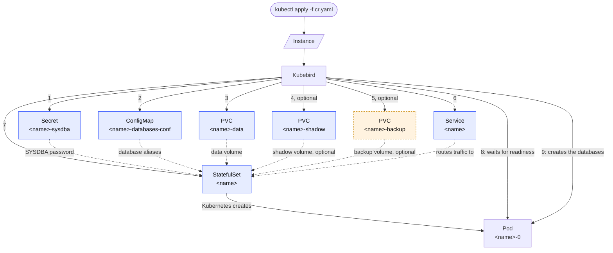

# Kubebird

## Overview
[Kubebird](https://github.com/henryx/kubebird) is a Kubernetes operator based on Python and `kopf` to install and manage [Firebird RDBMS](https://firebirdsql.org/) instances

## Architecture
Project uses the namespaced CR `Instances` that defines Firebird instance.

This is a sample of `Instances`:
```yaml
apiVersion: kubebird.github.io/v1
kind: Instance
metadata:
  name: firebird
spec:
  image: firebirdsql/firebird
  version: 3.0.14
  databases:
    - name: "instance.fdb"
      shadow: false
      pageSize: 8192 # defaults to 8192; one of 4096, 8192, 16384
      charset: UTF8 # defaults to UTF8
      collation: UTF8 # defaults to UTF8
    - name: "shadowed.fdb"
      alias: "enforced" # if not specified, uses database name as alias
      shadow: true
  service:
    type: ClusterIP
    port: 3050 # port the Service exposes the instance on; defaults to 3050
  storage:
    primary:
      class: "" # if empty, uses the default storage class
      size: 3Gi
    shadow: # can be omitted if no database below has "shadow: true"
      class: ""
      size: 3Gi
    backup: # can be omitted if we want to use S3 storage for backups
      class: ""
      size: 3Gi
  authentication:
    sysdba:
      secretRef: ""
```

With this CR, Kubebird can:
- Deploy an instance of Firebird, in a StatefulSet mode using `image` and `version` specified, in whichever namespace the `Instance` itself is created in.
- Create a service for the instance. Default service type is `ClusterIP`, exposed on `service.port` (defaults to `3050`); the pod's container port is always `3050` regardless of this setting.
- Define the PVC used for the instance's primary data (`storage.primary`) with specified size and storage class. If storage class isn't specified, it uses the default storage class. Size must be a valid Kubernetes quantity (e.g. `3Gi`, `500Mi`); the CRD rejects anything else.
- Optionally define a `<instance-name>-backup` PVC (`storage.backup`), mounted into the pod at `/var/lib/firebird/backup` for whatever backs up the instance's data to use; can be omitted if backups instead go to S3 storage. Unlike the primary/shadow PVCs, this one is **not** owned by the `Instance` — deleting the `Instance` leaves it (and the backup data on it) behind instead of garbage-collecting it.
- Declare a list of the databases managed by instance. Based by of the configuration, database can be instantiated in shadow mode; shadow files live on a second, separate PVC (`storage.shadow`), which is required if any database has `shadow: true`. Each database can also set `pageSize` (one of `4096`, `8192`, `16384`; defaults to `8192`), `charset` and `collation` (both default to `UTF8`).
- Register a Firebird alias for each database in `/opt/firebird/databases.conf`, so clients can connect using that alias instead of the in-pod filesystem path. Uses `alias` if set, otherwise falls back to the database's own `name` (e.g. `instance.fdb`).
- Authentication section is optional. If is specified, you can:
  - Declare SYSDBA database password using a secret. If secrets isn't specified, operator create a `<instance-name>-sysdba` secret with a random password. The secret has `username` (always `SYSDBA`) and `password` keys.
- Label every object it creates (PVCs, Service, StatefulSet, and the SYSDBA secret) with `kubebird.github.io/instance: <name>`, so `kubectl get all,pvc,secrets -l kubebird.github.io/instance=<name>` finds everything for one `Instance`.
- Report the most recent error, if any, in `status.error` — visible directly via `kubectl get instances` (an `Error` column) without needing to check the operator's own logs. It's cleared automatically once the `Instance` reconciles successfully again.

### Object creation flow

When an `Instance` is created, Kubebird creates the objects below in order (steps 1-6); each one is
owned by the `Instance` and removed automatically when the `Instance` is deleted. Kubernetes then
creates the Pod from the `StatefulSet`, and Kubebird waits for it to become ready before creating
the actual database files inside it (steps 7-8):



The dotted arrows show how the `StatefulSet` uses the other objects (the SYSDBA password from the
secret, database aliases from the ConfigMap, storage from the PVCs, traffic routing from the
Service) rather than a separate creation step. The shadow `PVC` only exists when `storage.shadow`
is set on the `Instance`; likewise the backup `PVC` only exists when `storage.backup` is set, and
is mounted at `/var/lib/firebird/backup` the same way the primary/shadow PVCs are mounted at their
own paths. The backup `PVC` (dashed outline above) is, unlike every other object here, not owned
by the `Instance` — see "Deleting an `Instance`" below.

Kubebird also reacts to updates on an existing `Instance`:
- Changing `spec.service.type`, `spec.service.port`, or `spec.version` reconciles the
  `Service`/`StatefulSet` in place.
- Adding an entry to `spec.databases` provisions just that new database (existing ones are left
  alone) and registers its alias immediately, without needing a pod restart.
- Rotating the SYSDBA secret's password (the auto-generated one, or a user-provided
  `authentication.sysdba.secretRef`) pushes the new password to the live server automatically, so
  the secret and the running instance never drift apart.

Deleting an `Instance` relies on Kubernetes garbage collection of the objects Kubebird created for
it (they're all owned by the `Instance`); the operator itself just logs the deletion and reports
`status.phase: Deleting` while that garbage collection runs. The one exception is the backup PVC
(`<instance-name>-backup`, from `storage.backup`): it is deliberately **not** owned by the
`Instance`, so deleting the `Instance` leaves it (and any backup data on it) in place instead of
garbage-collecting it along with everything else.

### Backup and restore

Backup is made by dedicated CR:
```yaml
apiVersion: kubebird.github.io/v1
kind: Backup
metadata:
  name: test
spec:
  instanceRef: firebird
  type: local # can be local or s3
  include:
    - instance.fdb
  exclude:
    - shadowed.fdb
  s3: # used only if type is S3
    location: "https://s3.remote-storage.com"
    credentials:
      ref: "secret"
    bucket: "firebird"
    path: "/"
```

When CR is created, backup is made in dedicated path in the pod. If S3 is configured,
backup is transferred to a configured S3 instance. If include and exclude fields are
missing, all databases are backupped. When CR is deleted, backup is removed.

Implementation notes:
- Requires the referenced `Instance` to have `storage.backup` configured (see above) — that's
  where the backup is staged, regardless of `type`. Each database is backed up with Firebird's
  own `gbak` tool (`gbak -backup -verify`, so its progress is visible in the operator's own logs),
  producing one `<database-name>.fbk` file per database.
- The backup directory is `<storage.backup mount>/<timestamp>-<Backup name>` (e.g.
  `/var/lib/firebird/backup/20260615T120000Z-test`), so backups from different `Backup` CRs (or
  repeated runs of the same name) never collide. The timestamp is generated once, on the first
  reconcile attempt, and recorded in `status.timestamp`; a retry after a transient failure reuses
  it instead of creating a new directory.
- `include`/`exclude` are matched against the referenced `Instance`'s own `spec.databases[].name`
  entries — `include` defaults to every database on the `Instance` when omitted, `exclude` is
  applied after that (removing any listed names) and defaults to none.
- `type: s3` requires a Secret, named by `s3.credentials.ref` in the same namespace, holding
  `accessKey`/`secretKey` keys. Backups still land in the local path first either way; with `type:
  s3` each file is additionally uploaded (via `boto3`) to `s3://<s3.bucket>/<s3.path>/<timestamp>-<Backup
  name>/<database-name>.fbk`.
- Deleting the `Backup` CR removes the local backup directory from the `Instance`'s pod and, for
  `type: s3`, the uploaded S3 object(s) too — both the local files and, if applicable, the S3
  copies are considered part of that one `Backup`'s lifecycle. If the `Instance` was already
  deleted first, the local removal is skipped (there's no pod left to exec into) but the PVC
  itself, and any S3 copies, are unaffected.
- Restore isn't implemented yet — only the backup half of this section.

## Installation

To install Kubebird in the Kubernetes cluster, you can use these commands:
```bash
kubectl apply -f deploy/crd.yaml -f deploy/backup-crd.yaml
kubectl apply -f deploy/operator.yaml
```
`deploy/operator.yaml` creates its own `kubebird-system` namespace and deploys the operator into it
(Deployment, ServiceAccount, and the RBAC it needs) — no `-n <namespace>` needed. `Instance`/`Backup`
CRs must be created in `kubebird-system` too, since the namespaced `Role`/`RoleBinding` only grant
access there.

The operator itself runs via the `kubebird-operator` console script (on `uvloop`):
```bash
uv run kubebird-operator
# or, to scope it to a single namespace instead of the whole cluster:
NAMESPACE=kubebird-system uv run kubebird-operator
# or, to control log verbosity (DEBUG/INFO/WARNING/ERROR/CRITICAL; defaults to INFO):
LOG_LEVEL=DEBUG uv run kubebird-operator
```
`deploy/operator.yaml`'s Deployment sets a fixed `LOG_LEVEL: INFO` — edit that value directly to
change verbosity for an in-cluster deployment.

To build the container image instead:
```bash
docker build --build-arg VERSION=0.1.0 -t kubebird:0.1.0 .
```
The image runs as a non-root `appuser` (uid 8877) on a Red Hat UBI10 base and starts
`kubebird-operator` by default.


## Development Commands
```bash
# Setup
$ uv init --name Kubebird --app --description "Kubebird - A Kubernetes operator for Firebird" --build-backend uv --no-readme
$ uv add kopf kubernetes uvloop boto3
$ uv add --dev pytest pytest-cov tox ruff mypy pyyaml types-pyyaml boto3-stubs
$ uv add --dev testcontainers
```
For e2e tests, `testcontainers` is used to run a k3s cluster: `tests/conftest.py` defines a
session-scoped `k3s` fixture (`testcontainers.community.k3s.K3SContainer`), tested on its own in
`tests/test_k3s.py`. A `kubeconfig` fixture builds on it to point the `kubernetes` client library
at the container.

`tests/test_create.py` uses that fixture, together with [kopf's testing
utilities](https://docs.kopf.dev/en/stable/testing/), to apply `deploy/crd.yaml` and
`deploy/cr.yaml` against the k3s cluster and run the operator in-process via
`kopf.testing.KopfRunner`. These are real end-to-end runs: each waits for `status.phase` to reach
`Ready` (StatefulSet + real Firebird image pull + database provisioning over `isql`), then execs
into the pod to confirm the relevant database file actually exists on disk before deleting the
`Instance`. There are two such tests: `test_create_instance` checks the primary database and that
its alias (plus the version-specific `security.db` alias) landed in `/opt/firebird/databases.conf`,
and `test_create_instance_shadow_database` checks that a database with `shadow: true` gets its
shadow file on the separate shadow PVC.

`tests/test_update.py` covers the update-reconciliation behaviour the same way: patching an
already-`Ready` `Instance`'s `service.type`/`service.port`/`version`/`databases`, and rotating its
SYSDBA secret's password (both the auto-generated one and a user-provided `secretRef`), then
confirming the change actually took effect against the live `Service`/`StatefulSet`/pod.

`tests/test_delete.py` covers deletion the same way: deletes a `Ready` `Instance` and confirms it
actually disappears (not just that the delete call returned) and that Kubernetes garbage-collects
the `StatefulSet` it owned.

`tests/test_backup.py` covers the `Backup` CR the same way, against `deploy/backup-crd.yaml`/
`deploy/backup-cr.yaml`. `test_backup_instance_local` creates a `Ready` `Instance`, then a `type:
local` `Backup`, waits for it to reach `status.phase == "Ready"`, execs into the pod to confirm the
`.fbk` file exists under the recorded `status.path`, deletes the `Backup`, and confirms that path is
gone. `test_backup_instance_s3` does the same with `type: s3`, additionally starting a throwaway
`pgsty/silo` container (`testcontainers.core.container.DockerContainer`, not a dedicated
testcontainers module — a maintained, S3-API-compatible MinIO fork) as the S3 target: it polls
`list_buckets()` until the container accepts connections, creates the test bucket, then after the
`Backup` reaches `Ready` confirms the uploaded object exists via `head_object`, and that it's gone
(a `ClientError` with code `404`/`NoSuchKey`) after the `Backup` is deleted.

`tests/test_k3s.py::test_operator_yaml_deploys_and_grants_expected_rbac` applies both
`deploy/crd.yaml`/`deploy/backup-crd.yaml` and every object in `deploy/operator.yaml` (Namespace,
ServiceAccount, ClusterRole/ClusterRoleBinding, Role/RoleBinding, Deployment), then checks, via
`SubjectAccessReview`, that the resulting ServiceAccount actually gets every permission the
operator's code calls for (`instances`/`instances/status` and `backups`/`backups/status` included)
— much faster than the other suites since it doesn't need the container image to actually be
pullable or any pod to schedule.

## CI

`.github/workflows/ci.yml` runs the full `tox` suite above on every branch push, whenever a pull
request is opened or updated, and on every "approved" pull request review — no image is built for
any of these. Pushing a tag (e.g. `v1.2.3`) instead skips the test suite and only builds and pushes
an image to `quay.io/kubebird/operator`, tagged both `:latest` and with the tag name itself.
Requires repo secrets `QUAY_USERNAME`/`QUAY_PASSWORD`.

## License

Kubebird is licensed under the [Apache License 2.0](LICENSE).
